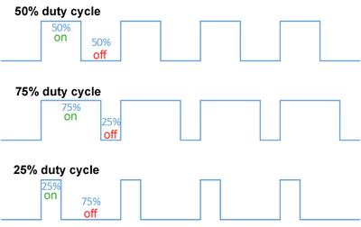
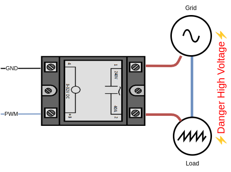

# Solid State Relay Regulator

A relay is able to let current pass to the load or not. By sending small part of current (blinking), it is possibile to divert a well defined amount of energy to the load.

!!! tip "Tip: This regulator can also be used with a triac"

??? note "How does this regulator work?"
    This regulator is sending a PWM (Pulse Width Modulation) signal to the relay. The period of the PWM is 330ms. The duty cycle determine the amount of energy transfered.  
    If you want to know more how a PWM can regulate the transmited energy, you can refer to [Wikipedia](https://en.wikipedia.org/wiki/Pulse-width_modulation).  
    <figure markdown="span">
      { width="300" } 
      <figcaption>Duty Cycle examples (Source: Wikipedia)</figcaption>
    </figure>


!!! warning
    It is recommanded to attched the relay to a heat dissipator.

The following schematic is representing the wiring of the relay:



To use this package, add the following lines to your configuration file:

```yaml linenums="1"
packages:
  regulator:
    url: http://github.com/XavierBerger/ESPHome-Solar-Router/
    file: solar_router/regulator_solid_state_relay.yaml
```

This package require the definition of pin connected to the gate of the relay : `regulator_gate_pin`

```yaml linenums="1"
substitutions:
  # Regulator configuration ------------------------------------------------------
  # Define GPIO pin connected to the relay gate.
  regulator_gate_pin: GPIO22
```