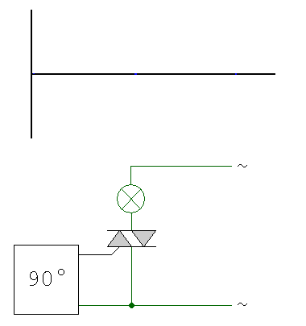
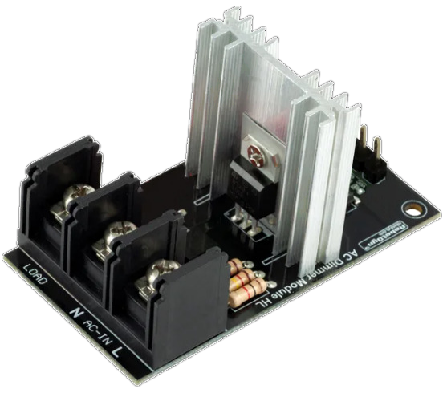
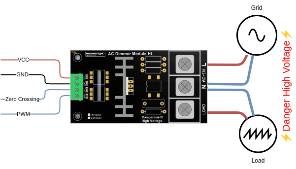

# Triac Regulator

This regulator is performing a **Phase Control Regulation**.


A triac is able to split the current sent to the load to reduce the power transmitted.  
This component is the base of AC Dimmers.

??? note "How does this regulator work?"
    If you want to know more how a triac can regulate the transmited energy, you can refer to [Wikipedia](https://en.wikipedia.org/wiki/TRIAC#Application).  
    The following schema is showing how the input sinus is cut to reduce the energy transfered to the load:

    <figure markdown="span">
      { width="300" } 
      <figcaption>Sinus spliting (Source: Wikipedia)</figcaption>
    </figure>
    

In this package, we propose to use a board manufactured by RobotDyn.

{ width="300" }

!!! warning
    The triac is supposed to support up the 24A (which represent a power greater than 5500W). The heat dissipator is undersized regarding to the level of energy which is supported by the triac. It is then recommanded to replace the heat dissipator with a bigger one.
The following schematic is representing the wiring of the board:


To use this package, add the following lines to your configuration file:

```yaml linenums="1"
packages:
  regulator:
    url: https://github.com/XavierBerger/Solar-Router-for-ESPHome/
    file: solar_router/regulator_triac.yaml
```

This package require the definition of pin connected to the triac module for zero crossing detection (`regulator_zero_crossing_pin`) and gate/PWM control (`regulator_gate_pin`)

```yaml linenums="1"
substitutions:
  # Regulator configuration ------------------------------------------------------
  # Define GPIO pin connected to AC Dimmer for gate and zero crossing detection.
  regulator_gate_pin: GPIO22
  regulator_zero_crossing_pin: GPIO23
```
